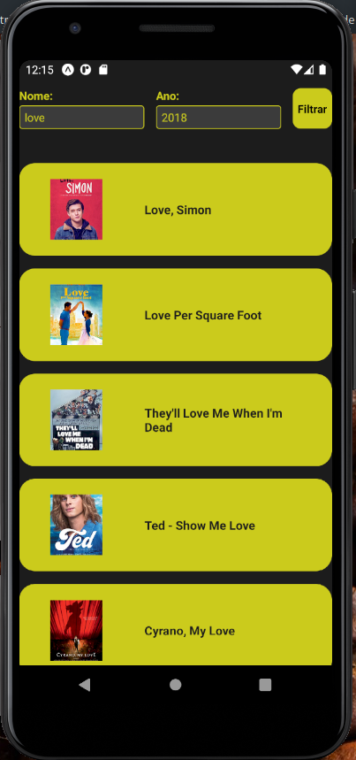

# MyMovie

Um projeto simples de listar filmes com Filtros.

## Fotos

[]
[]
[]

## Descrição 

Projeto que possui filtros de nome e ano e retornar os primeiros 10 itens 

## Dependencia

- [app do Expo](https://play.google.com/store/apps/details?id=host.exp.exponent&hl=pt_BR&gl=US)

### Executando o programa

```
git clone https://github.com/LuizFelipeBG/movies-list.git
yarn install
yarn start
```

## Authors

Contributors names and contact info

ex. Luiz Felipe Barbosa  
ex. [@LuizFelipeBG](https://github.com/LuizFelipeBG)
